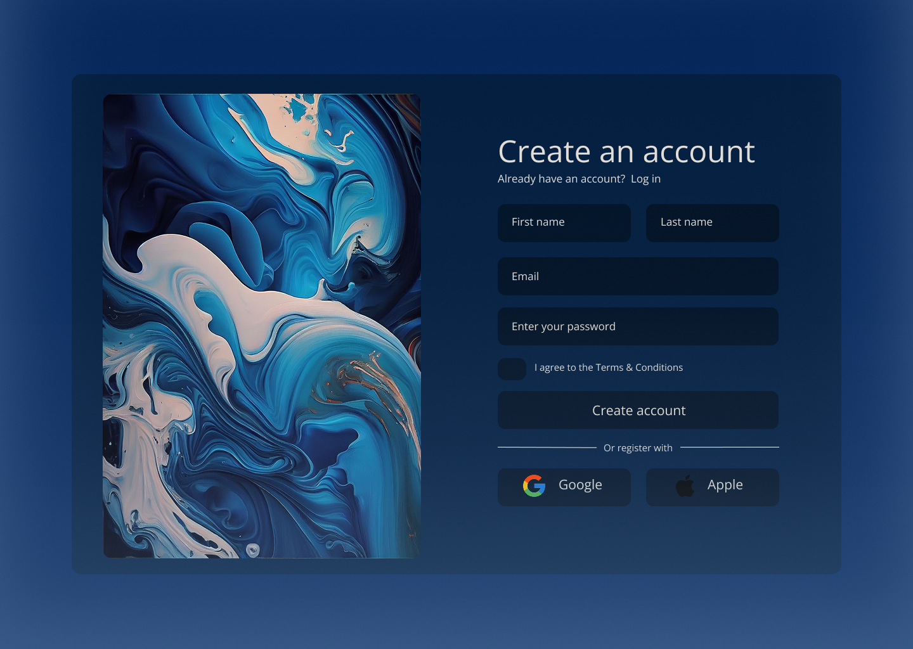

### 📋 Sobre o projeto
Este é um projeto pessoal de uma tela de registro (Register Screen) desenvolvida com HTML e CSS, baseada em um layout criado no Figma. O objetivo é praticar e aprimorar habilidades de front-end, com possíveis implementações futuras em JavaScript.

### 🛠️ Tecnologias utilizadas
**Figma**: Prototipagem do design. 
**HTML5**: Estrutura semântica do formulário. 
**CSS3**: Estilização com Flexbox e responsividade (em desenvolvimento). 
**JavaScript**: Futuramente, para validação de formulário e interações. 

### 🎨 Objetivo final (projeto ainda em andamento)

  

 

### Próximos passos
- Implementar efeitos de hover nos botões
- Adicionar validação de formulário com JavaScript
- Implementar em um ecossistema de login
